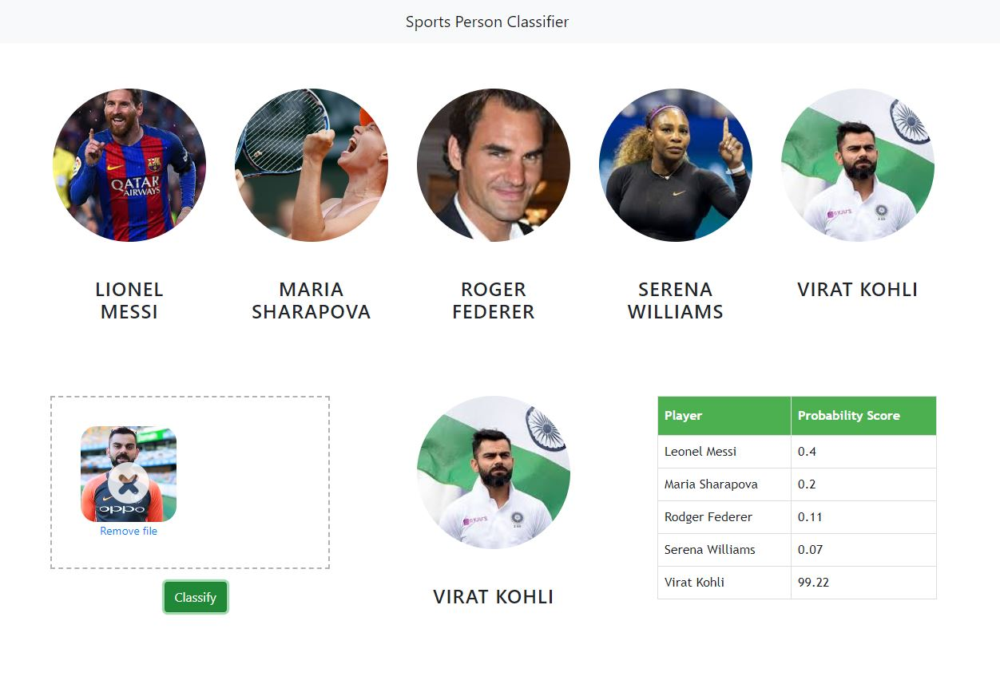

## Information 
In this data science and machine learning project, we classify sports personalities. We restrict classification to only 5 people,
1) Maria Sharapova
2) Serena Williams
3) Virat Kohli
4) Roger Federer
5) Lionel Messi

Here is the folder structure,
* UI : This contains ui website code 
* server: Python flask server
* model: Contains python notebook for model building
* google_image_scrapping: code to scrap google for images
* images_dataset: Dataset used for our model training

If you are interested in contributing to make this project then please follow [code-style](#code-style) and [contribution steps](#step-to-contribute)
 


## Technologies used in this project,
1. Python
2. Numpy and OpenCV for data cleaning
3. Matplotlib & Seaborn for data visualization
4. Sklearn for model building
5. Jupyter notebook, visual studio code and pycharm as IDE
6. Python flask for http server
7. HTML/CSS/Javascript for UI


<a id="contribute"></a>
## Step to Contribute

<details><summary>Click here</summary>
<p>

**1.**  Fork [this](https://github.com/Google-Developer-Student-Club-RAIT/ImageClassification_SklearnSVM-AI-ML) repository.

**2.**  Clone your forked copy of the project.

```
git clone https://github.com/Google-Developer-Student-Club-RAIT/ImageClassification_SklearnSVM-AI-ML.git 
```

**3.** Navigate to the project directory :file_folder: .

```
cd ImageClassification_SklearnSVM-AI-ML
```

**4.** Add a reference(remote) to the original repository.

```
git remote add upstream https://github.com/Google-Developer-Student-Club-RAIT/ImageClassification_SklearnSVM-AI-ML
```

**5.** Check the remotes for this repository.
```
git remote -v
```

**6.** Always take a pull from the upstream repository to your master branch to keep it at par with the main project(updated repository).

```
git pull upstream main
```

**7.** Create a new branch.

```
git checkout -b <your_branch_name>
```

**8.** Perform your desired changes to the code base.


**9.** Track your changes:heavy_check_mark: .

```
git add . 
```

**10.** Commit your changes .

```
git commit -m "Relevant message"
```

**11.** Push the committed changes in your feature branch to your remote repo.
```
git push -u origin <your_branch_name>
```

**12.** To create a pull request, click on `compare and pull requests`. Please ensure you compare your feature branch to the desired branch of the repository you are supposed to make a PR to.


**13.** Add appropriate title and description to your pull request explaining your changes and efforts done.


**14.** Click on `Create Pull Request`.


**15** Congratulations! You have made a PR. Sit back patiently and relax while your PR is reviewed.


</p>
</details>

## Code-Style

// make wiki guide page for kotlin code-style  

### Contributors

### Contact

Maintainer : jadhavAkshay0701@gmail.com

## LICENSE
Copyright (c) **GDSC Rait**. All rights reserved. Licensed under the MIT License

[](LICENSE)

